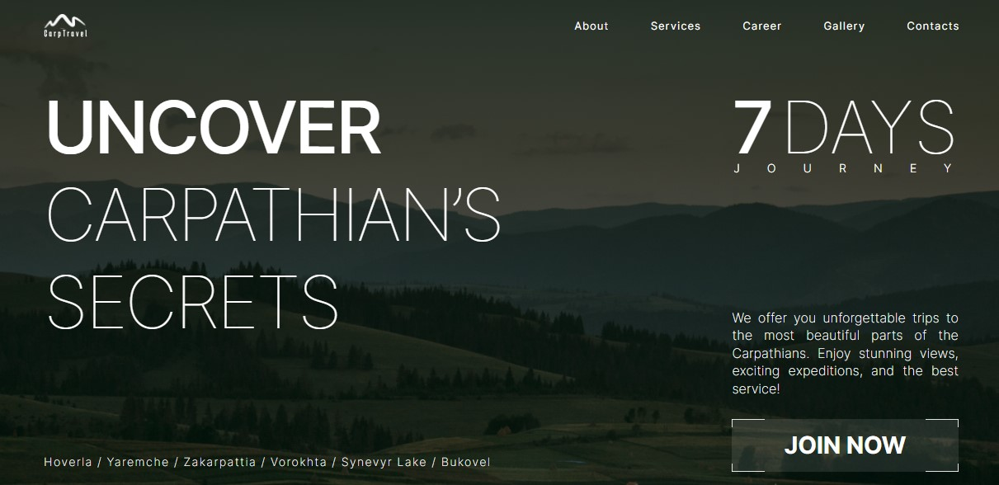

# Carp Travel

**[LIVE PAGE](https://carp-travel-lovat.vercel.app/)**



Landing Page

The layout is responsive and cross-browser, designed with a mobile-first approach. The breakpoints
are as follows: mobile (320px to 480px), tablet (768px), desktop (1280px).

Used technologies: Next.js, TypeScript, Tailwind, react-hook-form, Swiper.js, MUI, react-input-mask,
react-toastify, clsx.

## Content

Page consist from:

- Header. Include logo and nav menu. In mobile, menu is hidden and becomes visible by clicking menu
  btn. Clicking on the relevant item triggers a seamless scroll to the corresponding section.
- Hero. When you click on "Join Now," a smooth scroll will take you to the "Contacts" section.
- About.
- Services. Slider with various background images. Utilizes a fade effect. The active item is
  stylistically highlighted.
- Career. Form with validation of entered data. Stylish checkbox. Upon successful data submission, a
  corresponding message is displayed.
- Gallery. On Tablet & Desktop: Infinite slider. The active slide has a larger size. Slides can be
  changed by pressing the respective buttons or by dragging.
- Contacts. Form with validation of entered data. Upon successful data submission, a corresponding
  message is displayed.

### Getting Started

First, run the development server:

```bash
npm run dev
# or
yarn dev
# or
pnpm dev
# or
bun dev
```

Open [http://localhost:3000](http://localhost:3000) with your browser to see the result.
